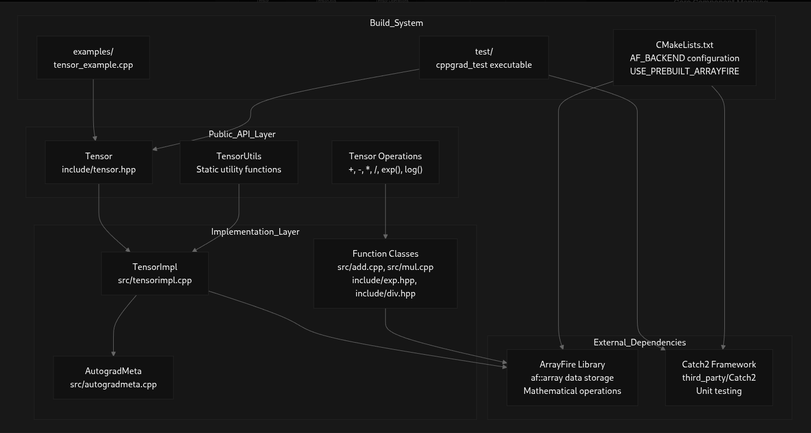

# **cppgrad**

**A High-Performance C++ Neural Network Library**

- **Header-only API layer** for ease of development
- **Modular core implementation** (.cpp files) for optimized performance
- Built on top of **ArrayFire** for accelerated tensor operations

---

## Features

* **Tensor Operations**: Multi-dimensional arrays with support for arithmetic, reductions, and advanced indexing.
* **Autograd Engine**: Build computation graphs and perform automatic differentiation.
* **Prebuilt Gradient Functions**: `Neg`, `Exp`, `Log`, `Pow`, `Sum`, `Mean`, `Max`, and more.
* **Extensible Backend**: Swap ArrayFire with custom backends (e.g., CUDA, OpenCL).
* **Examples & Tests**: Ready-to-run examples and a comprehensive test suite.
* **Modern CMake**: Easy integration into your projects via `find_package` or submodule.
* **Benchmarking Support**: Easy benchmarking of operations via google benchmarks.



---

## Installation

You can integrate `cppgrad` in two main ways:

1. **Clone & Build**

   ```bash
   git clone --recurse-submodules https://github.com/Research-Commons/cppgrad.git
   ```
2. **Fetch via CMake**

   ```cmake
   include(FetchContent)
   FetchContent_Declare(
     cppgrad
     GIT_REPOSITORY https://github.com/Research-Commons/cppgrad.git
     GIT_TAG        main
   )
   FetchContent_MakeAvailable(cppgrad)
   ```

---

## Dependencies

* **C++17** or newer
* **CMake** ≥ 3.15
* **ArrayFire** (prebuilt or bundled)

    * If using prebuilt binaries, install via your package manager or from [ArrayFire releases](https://arrayfire.com/download).
    * If using the bundled source (`third_party/arrayfire`), it will build automatically.

Optional:

* **Docker**: Containerized development and CI builds
* **VSCode DevContainer**: Preconfigured environment (Highly Recommended)

---

## Quick Build & Run

### 1. Prerequisites (Fedora example)

```bash
sudo dnf install \
    git cmake gcc-c++ \
    fftw-devel blas-devel lapack-devel \
    libpng-devel hdf5-devel \
    boost-devel glm-devel
```

### 2. Build

```bash
cd cppgrad
mkdir build && cd build
cmake .. -DCMAKE_BUILD_TYPE=Release
make -j$(nproc)
```

### 3. Run Examples

```bash
./examples/tensor_example         # Examples to showcase how tensor class and diff engine works
```

---

## Docker & DevContainer

* **Docker**: `Dockerfile` provided for CPU/GPU builds.

  ```bash
  docker build -t cppgrad:latest .
  docker run --rm -it cppgrad:latest bash
  ```

* **VSCode DevContainer**:

    * `.devcontainer/devcontainer.json` and `Dockerfile` ready-to-use.

---

## VSCode Tasks & Debugging

When using Visual Studio Code, you can run these predefined tasks via **Terminal > Run Task** or by pressing `Ctrl+Shift+P` and selecting **Run Task**:

| **Task Label**                     | **Description**                                                                 |
|-----------------------------------|---------------------------------------------------------------------------------|
| **Build cppgrad**                 | Compiles the entire project using `cmake --build build --target all -j`.       |
| **Run Tensor Example**            | Executes the tensor example binary (`./build/examples/tensor_example`).        |
| **Run Tests**                     | Runs the test suite (`./build/test/cppgrad_test`) and outputs failures.        |
| **Rebuild and Run Tensor Example**| Sequentially builds the project and then runs the tensor example.              |

These tasks are defined in `.vscode/tasks.json` at the project root.

* **VSCode Debugging**: To debug, add a breakpoint to tensor_example.cpp and run using F5

---
## Usage Example

```cpp
#include <cppgrad/tensor/tensor.hpp>

int main() {
  using namespace cppgrad;

  // Create two requires_grad tensors
  Tensor a = Tensor::full({2,2}, 3.0f, /*requires_grad=*/true);
  Tensor b = Tensor::full({2,2}, 2.0f, /*requires_grad=*/true);

  // Perform operations
  Tensor c = a + b;
  Tensor d = c * b;

  // Backward
  d.backward();

  // Inspect gradients
  std::cout << "Grad of a:\n" << a.grad() << std::endl;
  std::cout << "Grad of b:\n" << b.grad() << std::endl;

  return 0;
}
```

---

## API Overview

### Tensors (`cppgrad::Tensor`)

* **Constructors**: `Tensor::zeros`, `Tensor::full`, `Tensor::rand`, etc.
* **Properties**: `.shape()`, `.dtype()`, `.requires_grad()`
* **Operations**: `+`, `-`, `*`, `/`, `.sum()`, `.mean()`, `.max()`, `.exp()`, etc.
* **Backward**: `.backward()`, `.grad()`

### Core Components

* **TensorImpl**: Underlying storage and metadata.
* **GradFn**: Base class for gradient functions.
* **Function subclasses**: `SumFunction`, `MeanFunction`, etc.

---

## Testing

```bash
cd build
ctest --output-on-failure
```

Tests cover(w.i.p):

* Tensor creation & manipulation
* Autograd correctness
* Edge cases & error handling

---

## Contributing

Contributions are welcome!

* Fork the repo
* Create a feature branch
* Write tests & documentation
* Open a PR

---

## License

This project is licensed under the **Apache 2.0 License**. See [LICENSE](./LICENSE) for details.

---

## Community & Support

* **Overview**: https://deepwiki.com/Research-Commons/cppgrad

* **Issues**: [https://github.com/Research-Commons/cppgrad/issues](https://github.com/Research-Commons/cppgrad/issues)
* **Discussions**: [https://github.com/Research-Commons/cppgrad/discussions](https://github.com/Research-Commons/cppgrad/discussions)
* **ArrayFire** Slack & Forums for backend questions
